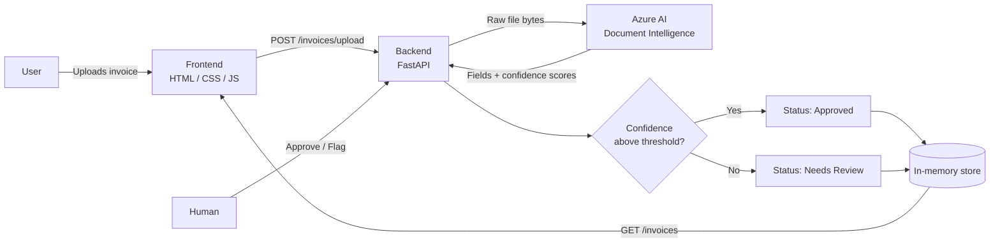
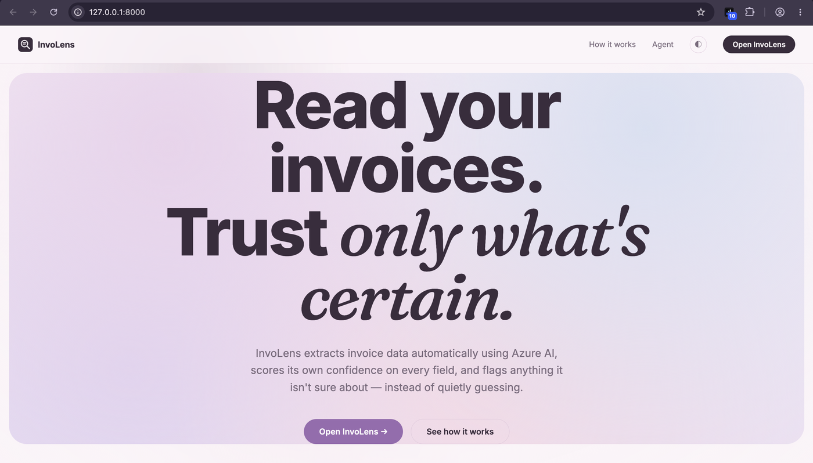
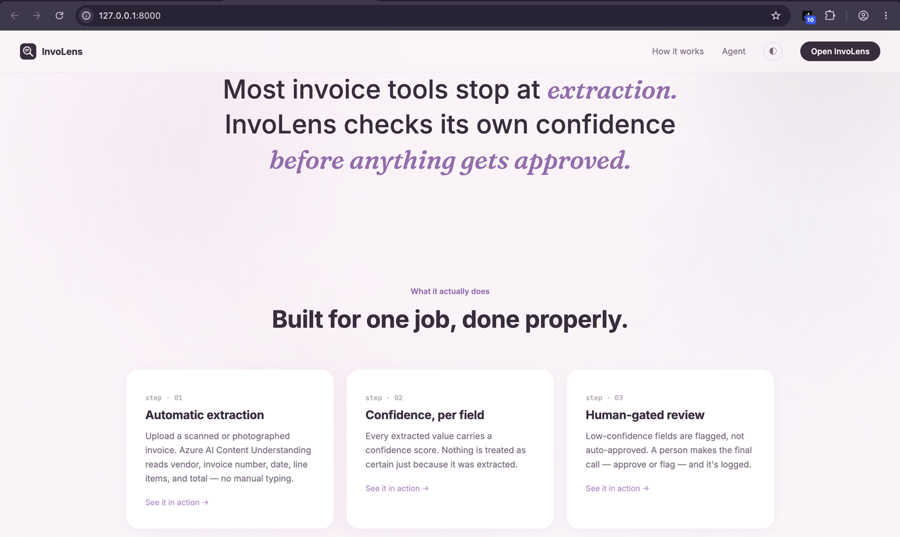
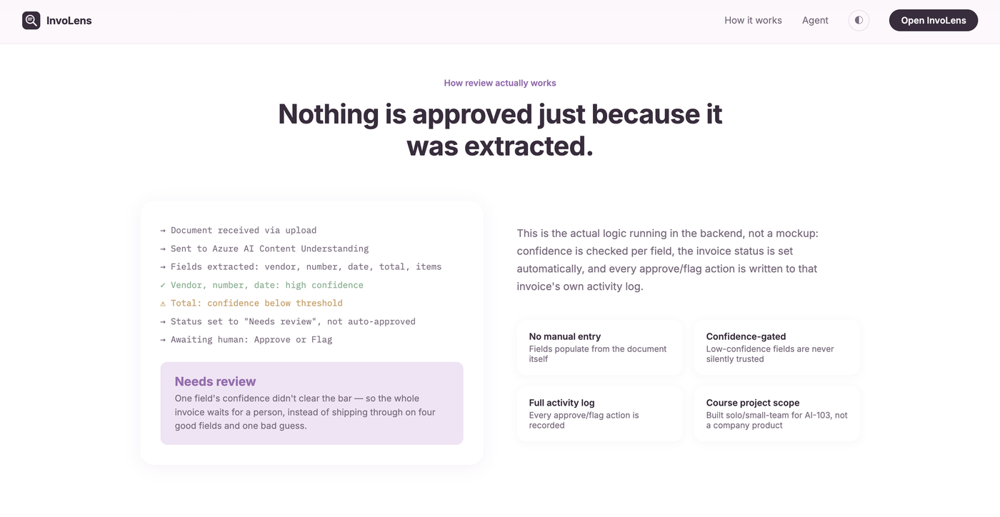
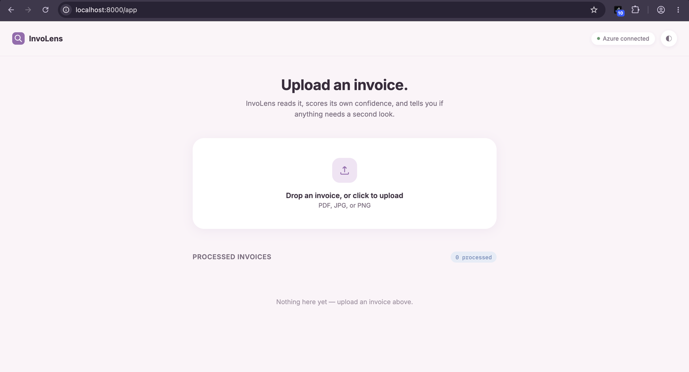
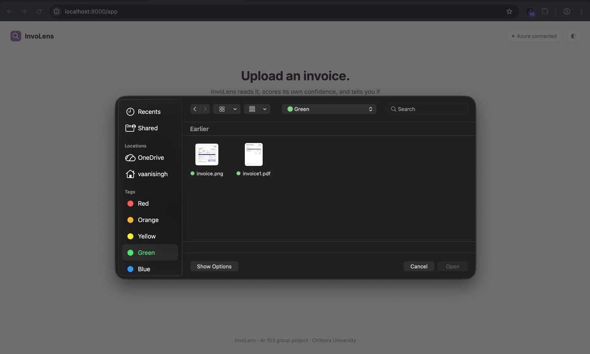
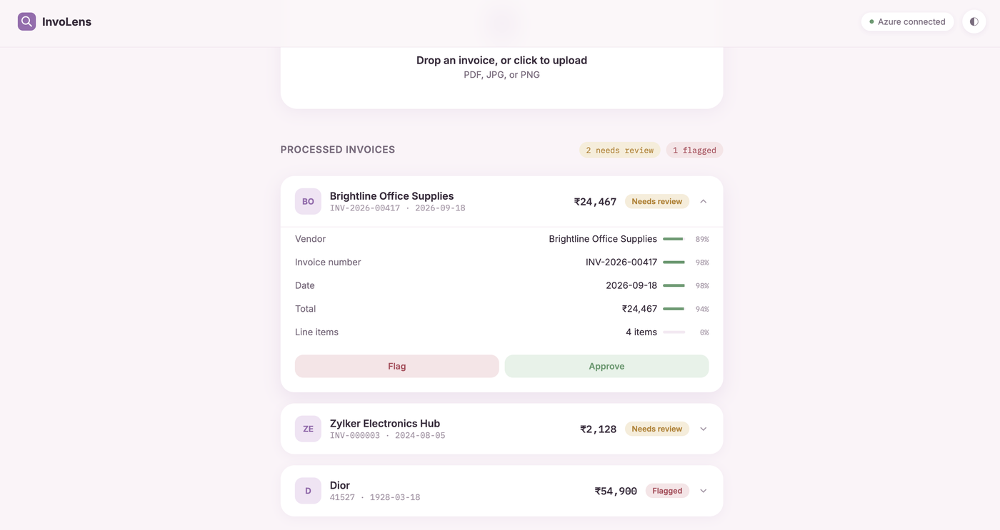
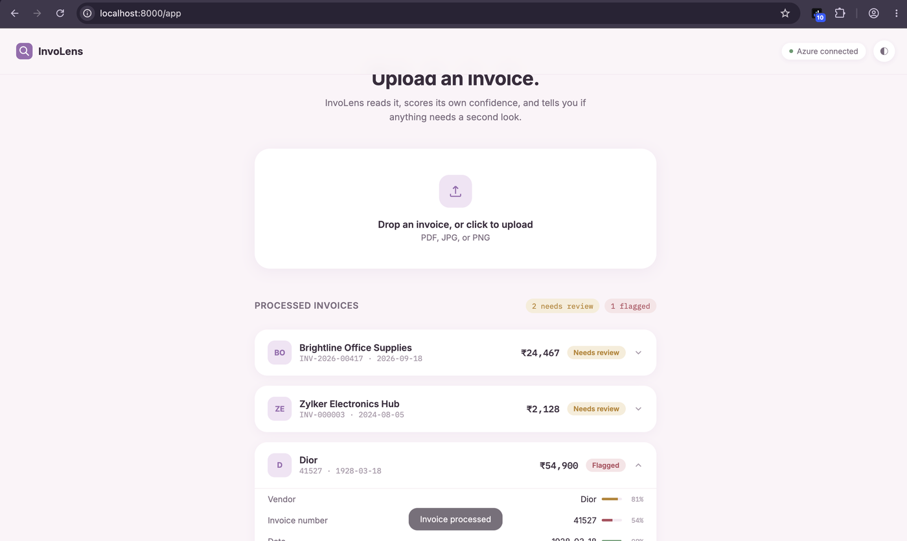

# InvoLens

**AI-powered Invoice Processing Assistant** — built for AI-103 (Develop AI Apps and Agents on Azure)

[]
[]
[]
[]

> Upload an invoice. InvoLens reads it with Azure AI, scores its own confidence on every field, and flags anything it isn't sure about — instead of quietly guessing.

---

## Team — Section 5G5

| Name | Roll Number | Role |
|---|---|---|
| Vaani | 2410992988 | Team Leader |
| Ojasvi Sethi | 2410992552 | Member |
| Vaani Singh | 2410992911 | Member |
| Manan Dhillon | 2410993476 | Member |
| Chirag | 2410993157 | Member |

---

## Links

| Deliverable | Link |
|---|---|
| GitHub Repository | [github.com/Vaani0702/Invoice-Processing-Assistant---InvoLens](https://github.com/Vaani0702/Invoice-Processing-Assistant---InvoLens) |
| 5-Minute Demo Video | [Watch on YouTube](https://youtu.be/Hp-LKD60_7E) |
| Project Overview PPT | [PPt] (https://1drv.ms/p/c/32891736f4f9f23e/IQBQA0uhRMmmRaT4UkEjZgyWAQRy-0On8AEbepCurso_7VQ?e=h66VrF) |

---

## Table of Contents

- [Problem Statement](#problem-statement)
- [Solution Overview](#solution-overview)
- [Solution Architecture](#solution-architecture)
- [Screenshots](#screenshots)
- [Technology Stack](#technology-stack)
- [Setup Instructions](#setup-instructions)
- [Testing and Results](#testing-and-results)
- [Known Limitations](#known-limitations)
- [Future Improvements](#future-improvements)
- [Responsible AI](#responsible-ai)
- [Acknowledgements](#acknowledgements)

---

## Problem Statement

In most small businesses, invoice processing is still manual. Someone opens a PDF or a
scanned invoice, reads the vendor name, invoice number, date, and total, and types all of
that by hand into a spreadsheet or accounting system.

This is slow, and it's easy to make mistakes — a mistyped total or a missed line item can
cause real problems later. We wanted to automate that first reading-and-typing step,
**without blindly trusting an AI to get everything right.**

## Solution Overview

InvoLens automates invoice data extraction using **Azure AI Document Intelligence**. Every
extracted field carries its own confidence score. If confidence is high, the invoice is
approved automatically. If any field's confidence is too low, the invoice is flagged for a
human to check before it's trusted — real human oversight, not automation for its own sake.

The project ships as two pages:

- **`/`** — a landing page explaining the concept
- **`/app`** — the actual working application (upload, review, approve/flag)

## Solution Architecture



**Request flow, in words:**

1. User uploads an invoice through the frontend (drag-and-drop or file picker)
2. Frontend sends the raw file to the backend via `POST /invoices/upload`
3. Backend forwards the file bytes directly to Azure AI Document Intelligence (`prebuilt-invoice` model) — no blob storage or public URL needed
4. Azure returns extracted fields (vendor, invoice number, date, total, line items), each with its own confidence score
5. Backend applies threshold logic and sets the invoice's status automatically
6. Frontend displays the result; a human can Approve or Flag, which is logged to that invoice's activity

## Screenshots

### Landing Page

*The pastel InvoLens landing page — states the core promise up front.*

### How It Works

*The three-step pipeline, explained on the page itself: extraction, confidence, human-gated review.*

### Responsible AI, Made Visible

*A real trace of the actual backend logic — showing exactly why an invoice gets flagged instead of approved.*

### The App — Upload Screen

*"Azure connected" status confirms this is live, not mocked data.*

### The App — Selecting a File

*A real invoice file being selected for processing.*

### The App — Processed Invoices

*Real extraction results with per-field confidence bars and status badges (Needs Review / Flagged / Approved).*

### Live Processing Feedback

*A live status toast confirms processing — no silent waiting, every state change is visible.*

## Technology Stack

| Layer | Technology | Purpose |
|---|---|---|
| Frontend | HTML, CSS, JavaScript | Single-page app, no build step |
| Backend | Python, FastAPI | API routing, confidence-threshold logic, review workflow |
| AI Service (primary) | Azure AI Document Intelligence (`prebuilt-invoice`) | Document extraction with confidence scoring |
| AI Service (fallback) | Azure AI Content Understanding | Used only if Document Intelligence isn't configured |
| AI Platform | Azure AI Foundry | Hosts the Cognitive Services resource |
| Retrieval (optional) | Azure AI Search | Indexing/search of processed invoices — code present, not yet wired to a live resource |

> **Why Document Intelligence over Content Understanding?** Content Understanding's supported
> regions didn't overlap with several team members' Azure for Students region policies.
> Document Intelligence has much broader regional availability and performs the identical
> extraction task, so it was used as the primary engine instead.

## Setup Instructions

```bash
# 1. Clone the repository
git clone https://github.com/Vaani0702/Invoice-Processing-Assistant---InvoLens.git
cd Invoice-Processing-Assistant---InvoLens/backend

# 2. Create a virtual environment
python -m venv venv
source venv/bin/activate      # Windows: venv\Scripts\activate

# 3. Install dependencies
pip install -r requirements.txt

# 4. Configure Azure credentials
cp .env.example .env
# then fill in AZURE_DI_ENDPOINT and AZURE_DI_KEY with your own Azure resource values

# 5. Run
uvicorn main:app --reload --port 8000
```

Then open:
- **http://localhost:8000/** — landing page
- **http://localhost:8000/app** — the working app

**Without Azure keys configured**, the app still runs — it returns mock data so the interface
can be tested independently of Azure setup.

## Testing and Results

Tested against three real invoices of increasing difficulty:

| Test Case | Vendor Detected | Confidence Range | Result |
|---|---|---|---|
| Standard business invoice (Zylker Electronics Hub) | Correct | 94–97% | Correctly flagged **Needs Review** (line items field scored 0%) |
| Retail receipt (Dior) | Incorrect — extracted the *customer* name as vendor | 54–98% | Correctly flagged **Needs Review**; lowest-confidence field (Invoice Number, 54%) was in fact the wrong one, showing confidence scoring genuinely reflects extraction uncertainty |
| GST invoice (Miss Alisha Kumari / Dior legal entity) | Vendor/Customer fields swapped by the model | 89–98% | Correctly flagged **Needs Review**; demonstrates a real, unscripted extraction error being caught by confidence gating rather than silently trusted |

**Key finding:** in every test, when the AI's extraction was wrong or uncertain, the
confidence-threshold logic caught it and routed the invoice to human review rather than
auto-approving incorrect data. This is the core behaviour the project set out to demonstrate.

## Known Limitations

- No persistent database — invoices are stored in memory and reset when the backend restarts. Acceptable for a course prototype.
- No authentication or user accounts — anyone with the URL can use the app. Fine for a single-laptop demo, not for production.
- Azure AI Search integration exists in code (`azure_search.py`) but is not connected to a live resource.
- Some student Azure subscriptions carry region-restriction policies that block Content Understanding entirely; Document Intelligence was used instead for broader compatibility, as documented above.
- Vendor/Customer field confusion can occur on invoices where the customer's name is more visually prominent than the vendor's — a known limitation of the underlying `prebuilt-invoice` model, not something InvoLens's own logic controls.

## Future Improvements

- Connect Azure AI Search to allow querying past invoices and detecting duplicates.
- Add a persistent database (e.g. SQLite or Cosmos DB) so data survives a restart.
- Add lightweight authentication if this were extended beyond a single-laptop demo.
- Add automated tests for the confidence-threshold logic in `main.py`.

## Responsible AI

This project treats "Responsible AI" as a design requirement, not an afterthought:

- **Transparency** — every extracted field shows its confidence score directly in the UI, not just the final value.
- **Human oversight** — nothing is auto-approved purely because it was extracted; low-confidence fields are always routed to a human.
- **Reliability under real-world testing** — tested against a genuinely imperfect real invoice (a retail receipt with an unconventional layout), not just a clean sample, and the review logic still caught the extraction error.
- **Privacy** — invoice data goes only to Azure, never to a third party. Credentials are kept in a gitignored `.env` file and never committed to this repository.

## Acknowledgements

- **Azure AI Document Intelligence** and **Azure AI Content Understanding** — Microsoft
- **FastAPI**, **python-dotenv**, **requests** — open-source Python libraries
- **Sample invoice image** used in one test case sourced from a publicly available demo receipt for testing purposes only; not used for any commercial purpose

---

<p align="center">Built for AI-103 · Section 5G5</p>
